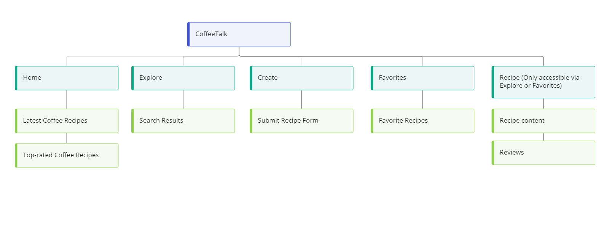

# **CoffeeTalk**

Link to demo : [CoffeeTalk]()

## Summary

---

## UI/UX

### User Goals

### Organisational Goals

### Structure and Skeleton

[Wireframes]()

### Design Decisions

#### Color scheme

(description of design decision) 

#### Fonts

(description of font decision)

---

## Features

| Features | Description |
| ----------- | ----------- |

---

## Limitations and Future Implementations

---

## Technologies Used

1. HTML

2. CSS

3. [Bootstrap 5](https://getbootstrap.com/docs/5.0/getting-started/introduction/) 
    - Used for buttons, tabs and offcanvas of website

---

## Testing

The website is tested for responsiveness using Developer Tools on Chrome browser for mobile, tablet and desktop screen widths.
The test cases can be found [here]().

---

## Deployment

The website is hosted using [Netlify](https://www.netlify.com/), deployed directly from the main branch of this Github repository.
For the detailed deployment steps, you can refer to the blog post on Netlify [here](https://www.netlify.com/blog/2016/09/29/a-step-by-step-guide-deploying-on-netlify/).

---

## Credits and Acknowledgement

### Logo :
1. [Adobe Express Logo Maker](https://www.adobe.com/express/create/logo) - Used to generate brand logo for website

### Fonts :
1. [Google Fonts](https://fonts.google.com/) - Used for fonts displayed in website 

### Icons :

### Data :

### Screenshot :
1. [CreateMockup.com](https://www.createmockup.com/generate/) - Used to generate responsive website mockup for README file