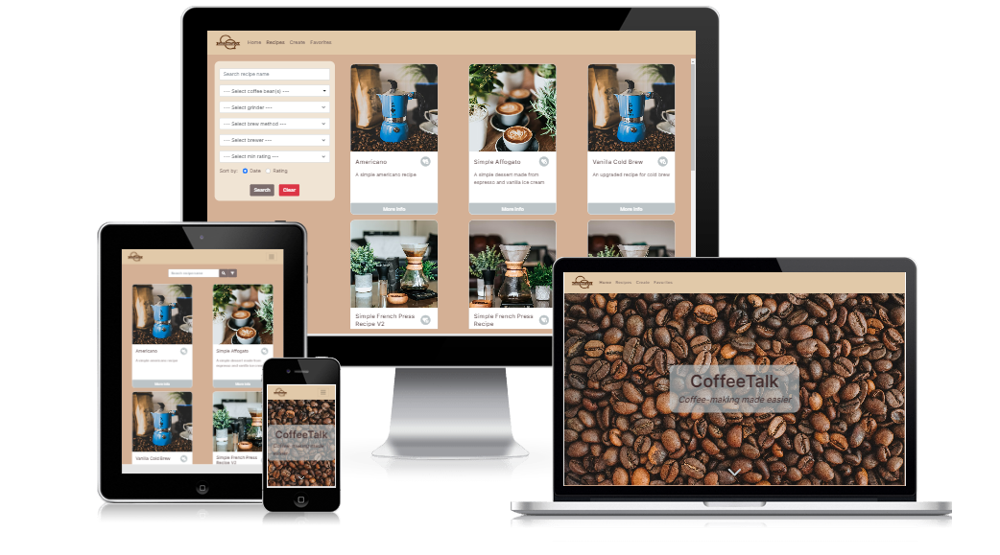
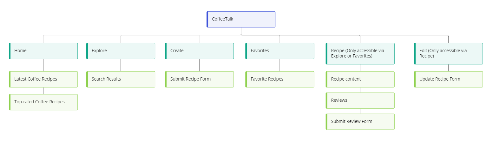
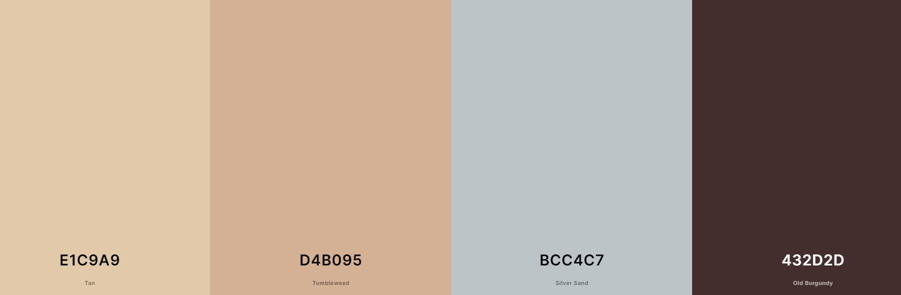

# **CoffeeTalk**

Link to demo : [CoffeeTalk](https://tgc-coffeetalk.netlify.app/)

## Summary

Specialty coffee making is an art, often involving many rounds of experimentation to achieve the "perfect" cup of coffee. In the process to reach this goal, many variables such as coffee rest period and water temperature have to be considered and controlled for. While every coffee bean is different and replicating the same cup of coffee is very hard, having access to relevant recipes can help narrow down the right variables to adjust, making the process less tedious and waste less coffee beans along the way. 

CoffeeTalk is a web application that aims to be a platform where coffee enthusiasts can share their coffee recipes and make use of the shared knowledge to improve their coffee-making experience without wasting precious coffee beans and spending large amount of time and effort on tedious trial-and-errors.

---

## UI/UX

### Strategy

#### User Goals

The users of CoffeeTalk are mainly people who have an interest in specialty coffee and coffee-brewing. The aim of users is to be able to find coffee recipes that suit their coffee preferences and setup with ease. Also, users would also want to be able to contribute their coffee recipes to be shared with the CoffeeTalk community who share the same interests as them. 

#### Organisational Goals

As a coffee hobbyist who likes to experiment new coffee recipes and enhance my coffee-making experience, I often find myself spending a large amount of time searching for coffee recipes across multiple sources such as Facebook groups and YouTube videos. However, most recipes found use a different set of coffee brewing equipment or are not detailed enough, and hence are difficult to re-create. Thus, a centralized informational site where coffee recipes are categorised by various coffee-related categories will be beneficial for those who are getting into coffee or are looking for coffee recipes that fit their coffee-making setups.

### Structure and Skeleton

#### Database

#### Sitemap

#### Wireframes
[Wireframes](readme/wireframes.pdf)

### Design Decisions

#### Color scheme

(description of design decision) 

#### Fonts

(description of font decision)

---

## Features

| Features | Description |
| ----------- | ----------- |

---

## Limitations and Future Implementations

---

## Technologies Used

1. HTML

2. CSS

3. [Bootstrap 5](https://getbootstrap.com/docs/5.0/getting-started/introduction/) 

4. [React Bootstrap](https://react-bootstrap.github.io/)

---

## Testing

The website is tested for responsiveness using Developer Tools on Chrome browser for mobile, tablet and desktop screen widths.
The test cases can be found [here]().

---

## Deployment

The website is hosted using [Netlify](https://www.netlify.com/), deployed directly from the main branch of this Github repository.
For the detailed deployment steps, you can refer to the blog post on Netlify [here](https://www.netlify.com/blog/2016/09/29/a-step-by-step-guide-deploying-on-netlify/).

---

## Credits and Acknowledgement

### Logo :
1. [Adobe Express Logo Maker](https://www.adobe.com/express/create/logo) - Used to generate brand logo for website

### Fonts :
1. [Google Fonts](https://fonts.google.com/) - Used for fonts displayed in website 

### Icons :

### Data :

### Screenshot :
1. [CreateMockup.com](https://www.createmockup.com/generate/) - Used to generate responsive website mockup for README file